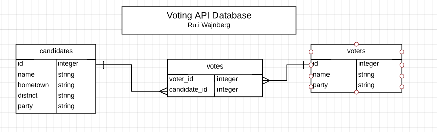

# Voting API

NOTE: This starting point was created by [Ruti Wajnberg](https://github.com/ru-T) of Cohort 5.  She rocks!

## Summary

This program is a Rails-based application about candidates, voters and their votes which serves up an API, responding with JSON.

## Description

This program has the following functionalities:

* Candidates with name, hometown, district, and party attributes
  - access an index view of all candidates
  - access a show view of an individual candidate, based on their ID

* Voters with name and party attributes
  - create a new voter with a name
  - see an individual voter, provided you authenticate that you are that voter
  - update information on a voter, provided you authenticate that you are that voter

* Votes with voter_id and candidate_id attributes
  - Each voter can cast at most one vote, period.
  - create a new vote, provided you authenticate that you are a voter
  - destroy that vote, provided you authenticate that you are that voter
  - access an index view of all candidates and a number of votes for each

## ERD of Table Structure

